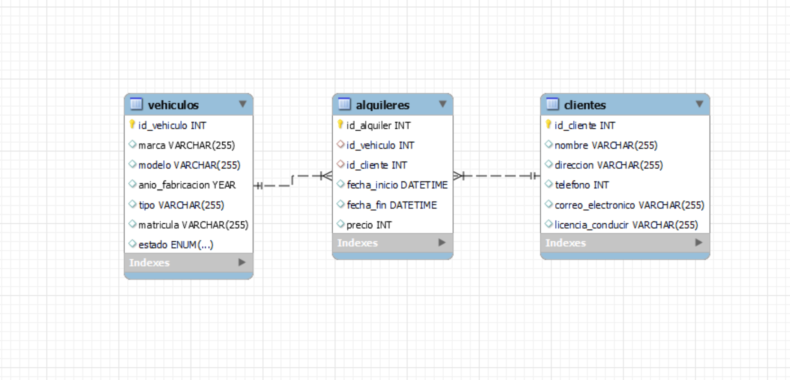

# Sistema de Alquiler de Vehículos

## Descripción del Problema:
Una empresa de alquiler de vehículos necesita gestionar la información sobre su flota de vehículos, clientes, alquileres y devoluciones. Los requisitos del sistema son los siguientes:

### Relaciones:
- Un vehículo puede ser alquilado muchas veces, pero cada alquiler está asociado a un solo vehículo en un momento dado (relación 1 entre Vehículos y Alquileres).
- Un cliente puede realizar varios alquileres a lo largo del tiempo, y cada alquiler corresponde a un cliente (relación 1 entre Clientes y Alquileres).
- Cada alquiler tiene una devolución asociada (relación 1:1 entre Alquileres y Devoluciones).

### Entidades y Atributos:
- **Vehículos**: ID de vehículo, marca, modelo, año de fabricación, tipo (sedán, SUV, etc.), número de matrícula, estado (disponible/no disponible).
- **Clientes**: ID de cliente, nombre, dirección, teléfono, correo electrónico, licencia de conducir.
- **Alquileres**: ID de alquiler, fecha de inicio, fecha de fin, ID de vehículo, ID de cliente, precio.
- **Devoluciones**: ID de devolución, ID de alquiler, fecha de devolución, estado del vehículo, observaciones.

## Instrucciones:
### Identificar Entidades y Atributos:
- **Vehículos**: ID de vehículo, marca, modelo, año de fabricación, tipo, matrícula, estado.
- **Clientes**: ID de cliente, nombre, dirección, teléfono, correo electrónico, licencia de conducir.
- **Alquileres**: ID de alquiler, fecha de inicio, fecha de fin, precio.
- **Devoluciones**: fecha de devolución, observaciones.

### Identificar Relaciones:
- Un vehículo puede estar involucrado en uno o más alquileres.
- Un cliente puede realizar uno o más alquileres.
- Un alquiler tiene una devolución correspondiente.
- Cada devolución está asociada a un alquiler.

## DIAGRAMA ENTIDAD-RELACIÓN

