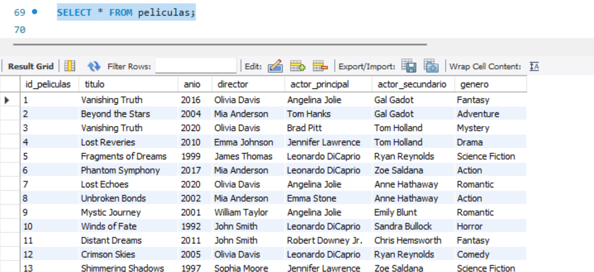
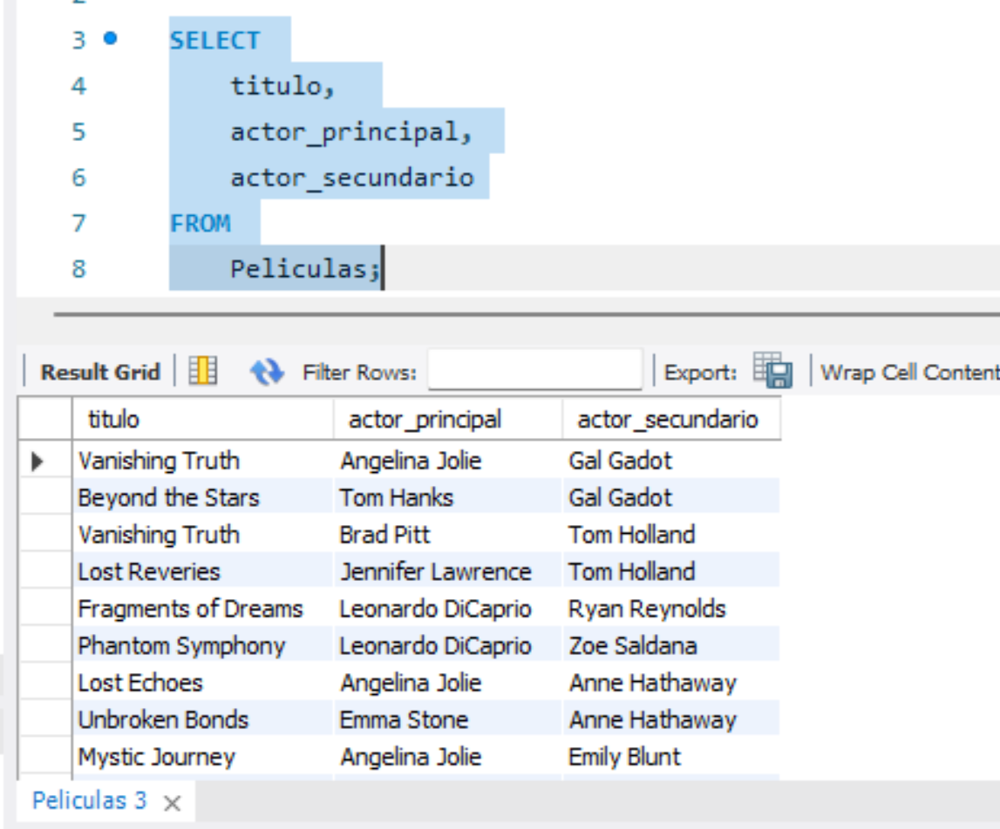

### Realiza consultas y funciones que afecten a varias tablas a la vez.

Primero usaremos la query para usar la bd correspondiente:

##### 1 - Una consulta que devuelva todas las películas.

##### 2 - Una consulta que devuelva las películas entre el 1980 y 2000 (usa el código del ejercicio anterior!)

##### 3 - Una consulta que devuelva la cantidad de películas de un género bajo el nombre de "num_peliculas" (Recuerda usar la palabra clave "AS")

##### 4 - Una consulta que devuelva todas las películas con sus actores principales y secundarios (deberían ser 3 tablas distintas)

##### 5 - Una consulta que seleccione todas las películas que tengan un actor específico (Por ejemplo: Tom Hanks)

##### 6 - Inserta datos en varias tablas a la vez usando START TRANSACTION y COMMIT. Recuerda usar también SET @variable

